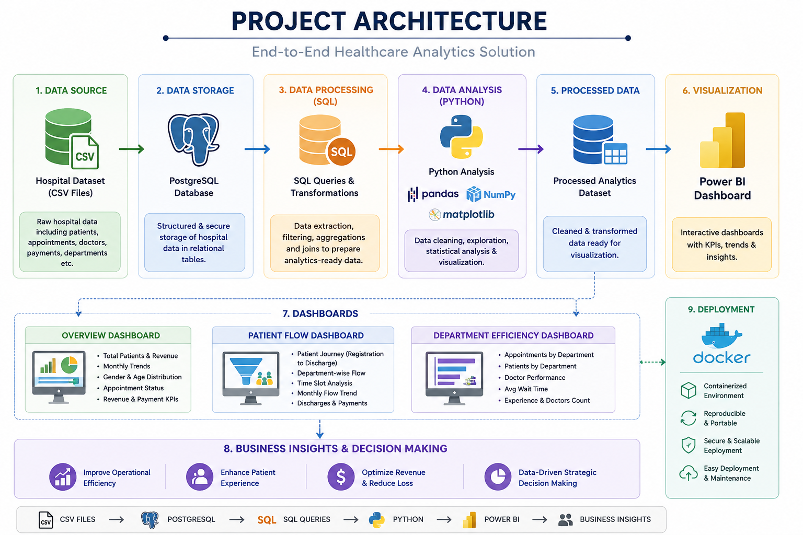
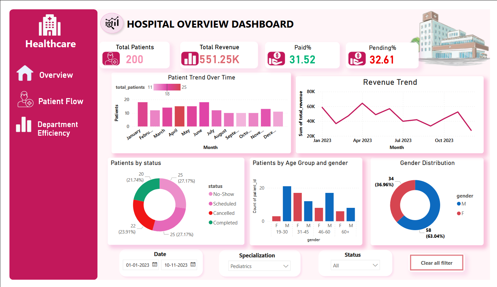
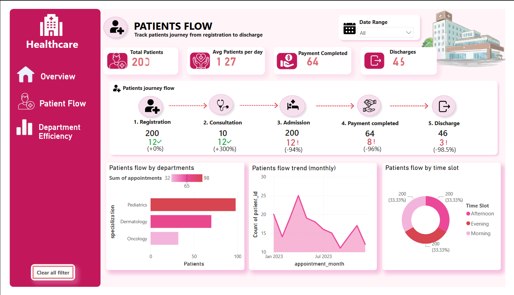
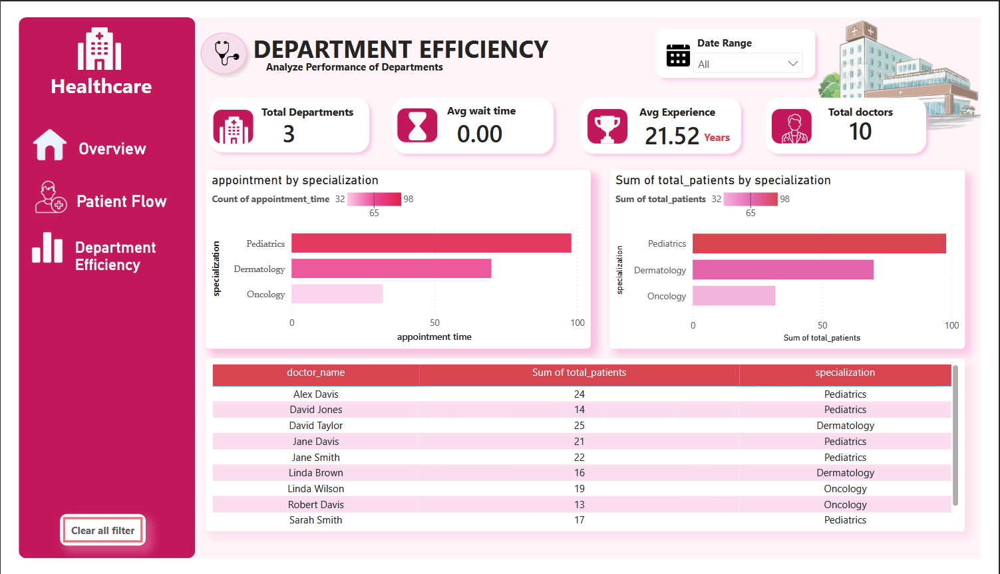
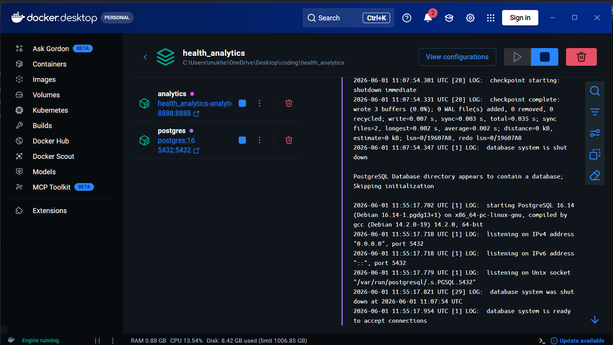

# 🏥 Hospital Analytics Dashboard

An end-to-end healthcare analytics project that analyzes hospital operations, patient flow, department performance, and revenue trends using SQL, Python, Power BI, and Docker.

---

## 🎯 Business Goal

Analyze hospital operations, patient flow, department efficiency, and revenue trends to support data-driven decision-making.

---

## 🛠️ Technology Stack

* PostgreSQL
* SQL
* Python (Pandas, Matplotlib)
* Power BI
* Docker

---

## 🎥 Demo Video

Add your YouTube walkthrough link here.

```text
https://youtu.be/7KRzSMAXA1o?si=usXiEwV5Ih_CBduX
```

---

## 🏗️ Project Architecture




---

## 📊 Dashboard Preview

### 🏥 Overview Dashboard



### 👥 Patient Flow Dashboard



### 🩺 Department Efficiency Dashboard



---

## 🔍 Key Insights

* Analyzed 200 patient records and generated ₹551K+ revenue insights.
* Tracked patient journeys from registration to discharge.
* Evaluated department-wise performance using appointment and patient volume metrics.
* Monitored doctor efficiency, wait times, and workload distribution.
* Analyzed patient demographics, appointment status, and payment trends.
* Delivered actionable insights through interactive Power BI dashboards.

---

## 🐳 Docker Configuration

The project is containerized using Docker to ensure a consistent and reproducible analytics environment.

### Container Structure



```text
Docker Container
│
├── PostgreSQL Database
├── SQL Scripts
├── Python Analytics
├── Processed Data
└── Power BI Dashboard
```

### Run the Project

#### Build Docker Image

```bash
docker build -t hospital-analytics .
```

#### Run Container

```bash
docker run -it --rm hospital-analytics
```

#### Using Docker Compose (Recommended)

```bash
docker-compose up --build
```

#### Run in Background

```bash
docker-compose up -d
```

#### Check Running Containers

```bash
docker ps
```

#### Stop the Project

```bash
docker-compose down
```

---

## ✨ Features

* PostgreSQL Database Integration
* SQL-Based Analytics
* Python Data Analysis & Visualization
* Interactive Power BI Dashboards
* Dockerized Environment
* Reproducible End-to-End Workflow

---

## 📁 Project Structure

```text
hospital-analytics/
│
├── data/
├── sql/
├── notebooks/
├── dashboards/
│   └── Hospital_Analytics.pbix
├── assets/
│   ├── project_architecture.png
│   ├── overview.png
│   ├── patient_flow.png
│   └── department_efficiency.png
├── Dockerfile
├── docker-compose.yml
├── requirements.txt
└── README.md
```
